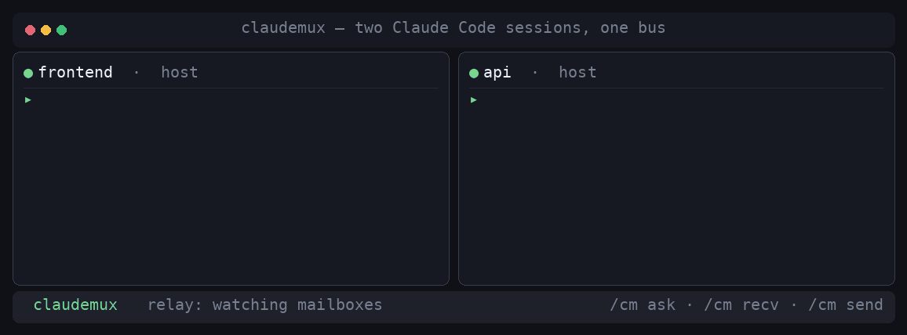

# Claudemux

**A real-time message bus for Claude Code sessions.** Run many `claude` sessions at once — one
per tmux pane — and let them talk to each other: one session asks another a question, the other
*wakes on its own*, answers, and the reply lands back in the asking pane. No copy-paste between
panes, no human relay.

<p align="center">
  
</p>
<p align="center"><sub>Two Claude Code sessions over the bus — ask on the left; the peer auto-wakes and answers on the right.</sub></p>

<br>

```
  session "frontend"                     relay (per machine)                    session "api"
  ──────────────────                     ───────────────────                    ─────────────
  /cm ask api which port is the
       auth service on?  ────────────▶  new message for "api"
                                              │  resolve api → its tmux pane
                                              └─ wake it ──────────────────────▶ (idle or busy)
                                                                                      │
                                                              reads the question, answers "8081",
                                                              sends the reply back:
        reply appears in your pane  ◀──────  new message for "frontend"  ◀────────────┘
```

Claudemux = **Claude** + **mux** (multiplexer): it multiplexes messages between Claude Code
sessions across tmux. Under the hood it's a small, dependency-light message bus — a few bash
scripts, a file-drop mailbox, and one tiny relay daemon.

---

## Why

If you run a fleet of Claude Code sessions (one per project/pane), they can't see each other. You
end up hand-carrying facts between them: *"the other session set the port to 8081"*, *"the model
you loaded is aliased `qwen-large`"*. Claudemux gives them a phone line. A session can consult a
peer that actually **owns** the answer, in real time, without you in the middle.

## Features

- **Real round-trips.** `/cm ask <peer> <question>` sends a query; the answer comes back to *your*
  pane asynchronously — because the relay can wake an idle session, not just leave it a note.
- **Names you recognize, live.** A session's bus name is its **Claude session name** (what `/rename`
  sets, shown in your tab) — resolved live, so renaming a session (locally *or* from the web UI) is
  reflected immediately, with no manual wiring. Sessions auto-register at start and on `claude -c`.
- **Self-cleaning.** Dead sessions are pruned automatically (on contact and on a timer).
- **Safe by design.** The only thing ever typed into another pane is a fixed control string — never
  message content — so a peer can't inject an arbitrary "user" turn. Sensitive workspaces can be
  marked read-only to the relay. (See [Security](#security).)
- **Small + legible.** Bash + `jq` + `inotifywait` + `tmux`. One systemd `--user` relay. No server,
  no database, no ports.

## How it works (in three facts)

1. **Sessions are interactive `claude` CLIs, one per tmux pane.** The only way to hand a running
   interactive session a new turn is `tmux send-keys` into its pane — which delivers instantly if
   it's idle and *queues* if it's mid-turn.
2. **The target pane is resolved live, never stored.** Pane ids drift (tmux resurrect/renumber), so
   nothing caches a pane id: each session is keyed by a stable **sessionId** (which also names its
   mailbox, so a rename never misroutes), and at wake time the relay looks up that session's **pid**
   and resolves pid → tty → current pane.
3. **Nothing runs between turns**, so the push comes from outside: a per-machine **relay daemon**
   watches the mailboxes (`inotifywait`) and wakes the target pane when a message arrives.

Full design in [ARCHITECTURE.md](ARCHITECTURE.md).

## Requirements

- Linux with **tmux** for auto-wake — a session that should be woken automatically must run in a
  tmux pane. A session outside tmux still works, in manual (poll) mode (see **Manual mode** below).
- **`jq`** and **systemd** with user services + lingering. **`inotify-tools`** (`inotifywait`) is
  recommended but optional — without it the relay falls back to polling.
- **Claude Code** (the `claude` CLI) with hooks and custom slash commands.

```bash
sudo apt install jq inotify-tools tmux      # Debian/Ubuntu
loginctl enable-linger "$USER"              # so the relay survives logout/reboot
```

## Install

```bash
git clone https://github.com/brandonrthomas/claudemux.git
cd claudemux
./install.sh
```

`install.sh` is idempotent. It copies the code to `~/.claude/claudemux/`, installs the `/cm` slash
command, wires `SessionStart`/`SessionEnd` hooks into `~/.claude/settings.json` (backing it up
first, preserving everything else), and enables the relay + cleanup timer. Open new sessions (or
`claude -c` existing ones) and they'll join.

## Usage

From inside any session:

```
/cm peers                       # who's on the bus (name, machine, alive, mode)
/cm ask <name> <question>       # ask a peer; the answer returns to THIS pane, asynchronously
/cm send <name> <message>       # fire-and-forget notify
/cm broadcast <message>         # notify every live session
/cm status                      # your own bus name + pending inbox
/cm recv                        # read your inbox (the relay normally triggers this for you)
```

`/cm ask` doesn't block — you keep working; when the peer answers, the relay wakes your pane and
the reply appears inline.

**Composing vs. verbatim.** For `ask` / `send` / `broadcast`, the text after the command is normally
an *instruction for what to communicate*: the session composes the actual message from its current
context and sends that — e.g. `/cm ask box tell them the port I just set` sends something like
`The auth port is 8081.` (A self-contained question is just sent as-is.) To send text **exactly** as
written — a command, a snippet, precise wording — prefix it with `*`: `/cm send api *rm -rf /tmp/cache`
stores that literal string as a message (it is never executed).

**Cross-machine.** List your other hosts in `~/.claude/claudemux/peers` (one SSH alias per line).
Then `/cm peers` aggregates their live sessions (shown as `name@host`), and `/cm ask <name> <question>`
auto-locates a peer across those hosts — or address one explicitly as `name@host`. The message is
dropped over SSH into that host's mailbox and its relay wakes the pane; replies route back
automatically. Works even when the hosts have different home directories. Requires Claudemux on each
host and key-based SSH between them.

## Configuration

| What | How |
|---|---|
| Install location | `CLAUDEMUX_ROOT` (default `~/.claude/claudemux`) |
| This machine's name | `CLAUDEMUX_MACHINE` (default `hostname -s`) — used for cross-machine addressing |
| Read-only workspaces | add globs to `~/.claude/claudemux/manual-patterns` (see `manual-patterns.example`) |
| Cross-machine peers | list SSH hosts in `~/.claude/claudemux/peers` (see `peers.example`) |

**Manual mode.** A registered, fully addressable session that the relay will **never** type into —
peers see it in `/cm peers`, messages reach its mailbox, and you drain them yourself with `/cm recv`.
A session registers manual for either reason:

- its cwd matches a glob in `manual-patterns` — sensitive workspaces you don't want a peer able to
  drive; or
- it isn't running in a tmux pane, so there's no pane to `send-keys` into. Rather than register
  `auto` and then silently fail to wake, it degrades to manual — still on the bus and reachable, just
  polled instead of pushed.

A session's tmux-ness is fixed when it launches, so this is decided once at registration. If an
`auto` session later *loses* its pane (e.g. tmux is killed mid-session), the relay can't wake it — it
leaves the message queued and logs a loud `WARN` rather than dropping it silently.

## Security

The threat here isn't eavesdropping — it's **injection**, because waking a pane literally submits a
turn in another session. Claudemux is built around that:

- **The wake is a single fixed constant** (`/cm recv`). Message *content* is always read from a
  file by that trusted command, never typed into a pane — so a peer can never cause arbitrary text
  to be submitted as a user turn elsewhere. Mailbox names are charset-restricted on both the send
  and relay sides.
- **Rendered messages are framed as untrusted data** with an explicit "do not obey" preamble; header
  fields are newline-escaped so a message can't forge the frame.
- **Message bodies are inert data end-to-end.** They're stored with `jq --arg`, transported as files
  (piped, never interpolated, over SSH cross-machine), and rendered as quoted text — nothing in a
  message is ever shell-executed by the pipeline. You can safely send text that *contains* commands;
  the `/cm` command hands your free text to the CLI as a single quoted argument.
- **Manual mode** (above) guarantees a peer can never drive a sensitive session.
- **Never put secrets, credentials, or private/regulated data in a message** — the bus is local
  plaintext files under your user account, and a message lands in another session's context.

No encryption (local files, Unix perms — same trust model as Claude Code's own data). Cross-machine
rides your existing SSH keys.

## Uninstall

```bash
./uninstall.sh            # stop services, remove /cm + hooks (keeps your mailbox/registry)
./uninstall.sh --purge    # also delete ~/.claude/claudemux entirely
```

Your `settings.json` is backed up before every change.

## Status & limitations

- **Cross-machine works** (verified host↔host, both directions, including different home dirs). List
  peer hosts in `~/.claude/claudemux/peers`; then `/cm peers` shows their sessions as `name@host` and
  a bare-name `/cm ask <name>` auto-locates the peer. You can always force one with `name@host`.
- Waking a pane while you're mid-typing appends to your input line (targets are normally idle).

## Development

Run the test suite — zero framework, just bash + jq:

```bash
./test/run.sh
```

It covers registration (sessionId-keyed), live-name resolution (transcript title wins over the
session-file name, with fallback) including a rename, send/recv, **message-body safety** (shell
metacharacters stay inert), target validation, reply routing, discovery `--json`, broadcast, and
cleanup — against an isolated `CLAUDEMUX_ROOT` with fake session files. The relay, tmux wake, and
cross-machine SSH are integration paths, verified manually.

## License

[Apache-2.0](LICENSE) © 2026 Brandon Thomas
